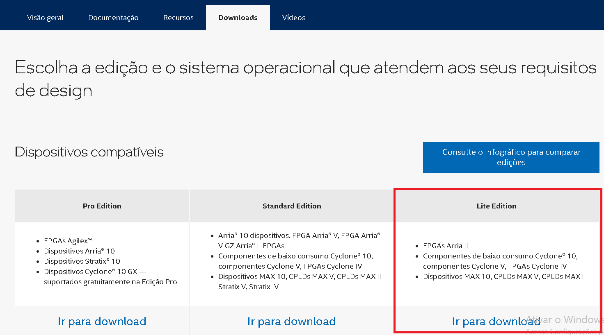

# Projeto de Circuitos Lógicos

## Sumário

- [1. Introdução](#1-introdução)
- [2. Instalação](#2-instalação)
  - [2.1 Instalação do Quartus e Questa](#21-instalação-do-quartus-e-questa)
    - [2.1.1 Primeiros passos](#211-Primeiros-passos) 
  - [2.2 Gerando a licença de ativação do Questa](#22-gerando-a-licença-de-ativação-do-questa)
  - [2.3 Possíveis erros de instalação e soluções](#23-possíveis-erros-de-instalação-e-soluções)
- [3. Projeto](#3-projeto)
  - [3.1 Criação e abertura de projeto](#31-criação-e-abertura-de-projeto)
  - [3.2 Primeiros passos no projeto](#32-primeiros-passos-no-projeto)
  - [3.3 Projetando](#33-projetando)
- [4. Simulação](#4-simulação)
  - [4.1 Criando uma simulação](#41-criando-uma-simulação)
  - [4.2 Simulando](#42-simulando)
  - [4.3 Possíveis erros de simulação e resoluções](#43-possíveis-erros-de-simulação-e-resoluções)
- [5. Codificador](#5-codificador)
- [6. Decodificador](#6-decodificador)
- [7. Multiplexador](#7-multiplexador)
- [8. Demultiplexador](#8-demultiplexador)
- [9. Somador/Subtrator](#9-somadorsubtrator)
- [10. Comparador de magnitude](#10-comparador-de-magnitude)
- [11. Deslocador de bits](#11-deslocador-de-bits)
- [12. Circuitos realimentados](#12-circuitos-realimentados)
- [13. Clock](#13-clock)
- [14. Latches](#14-latches)
- [15. Flip-flops](#15-flip-flops)
- [16. Registradores](#16-registradores)
- [17. Incrementador](#17-incrementador)

## 1. Introdução
&nbsp;
Este repositório é um recurso complementar destinado aos estudantes da disciplina de sistemas digitais ministrada pelo professor Bruno Nogueira na Universidade Federal de Alagoas. Aqui, você encontrará exemplos práticos, projetos e simulações de diversos circuitos lógicos utilizando as ferramentas Quartus e Questa. O material aqui presente visa auxiliar no aprendizado e na compreensão dos conceitos fundamentais abordados na disciplina.

## 2. Instalação

### 2.1 Instalação do Quartus e Questa
&nbsp;
Esta seção é dedicada à instalação do programa Quartus e do simulador Questa, que serão fundamentais para a montagem e simulação dos circuitos durante o curso. Essas ferramentas serão utilizadas para o desenvolvimento prático dos projetos abordados na disciplina.

#### 2.1.1 Primeiros passos
&nbsp;
Para iniciar a instalação, é necessário realizar o download dos softwares Quartus e Questa. Para baixar os softwares, acesse o link abaixo:

[Download do Quartus e Questa](https://www.intel.com.br/content/www/br/pt/products/details/fpga/development-tools/quartus-prime/resource.html)

&nbsp;
Em seguida, já no site da intel e na aba de downloads, selecione a Lite Edition

### 2.2 Gerando a licença de ativação do Questa

Após a instalação, é necessário gerar uma licença de ativação para o Questa. Detalhes sobre como fazer isso podem ser encontrados na documentação da Mentor Graphics.

### 2.3 Possíveis erros de instalação e soluções

Caso encontre problemas durante a instalação, consulte a seção de solução de problemas na documentação oficial ou na comunidade online.

## 3. Projeto

### 3.1 Criação e abertura de projeto

Para iniciar um novo projeto no Quartus, siga os passos para criar e abrir um novo projeto conforme descrito na documentação.

### 3.2 Primeiros passos no projeto

Após criar o projeto, inicie configurando as propriedades do projeto e adicionando os arquivos necessários.

### 3.3 Projetando

Desenvolva o projeto de acordo com as especificações do circuito lógico desejado, utilizando as ferramentas disponíveis no Quartus.

## 4. Simulação

### 4.1 Criando uma simulação

No Quartus, é possível criar simulações para verificar o comportamento do circuito antes da implementação física.

### 4.2 Simulando

Execute a simulação para validar o funcionamento do circuito lógico projetado. Analise os resultados obtidos durante a simulação.

### 4.3 Possíveis erros de simulação e resoluções

Se encontrar problemas durante a simulação, verifique as configurações de simulação, erros de sintaxe no código do circuito ou conflitos nas configurações de simulação e suas resoluções.

## 5. Codificador

### 5.1 Descrição do Codificador

Este módulo codifica um conjunto de entradas em uma saída específica.

## 6. Decodificador

### 6.1 Descrição do Decodificador

Este módulo decodifica um conjunto de entradas codificadas.

## 7. Multiplexador

### 7.1 Funcionamento do Multiplexador

O multiplexador seleciona uma entrada de várias para ser transmitida através de um único canal.

## 8. Demultiplexador

### 8.1 Funcionamento do Demultiplexador

O demultiplexador roteia dados de um único canal para vários canais de saída.

## 9. Somador/Subtrator

### 9.1 Descrição do Somador/Subtrator

Este circuito realiza operações de soma e subtração com números binários.

## 10. Comparador de magnitude

### 10.1 Funcionamento do Comparador de Magnitude

Este módulo compara duas entradas binárias e determina qual é maior.

## 11. Deslocador de bits

### 11.1 Descrição do Deslocador de Bits

O deslocador de bits move os bits em uma entrada para a esquerda ou direita.

## 12. Circuitos realimentados

### 12.1 Explicação de Circuitos Realimentados

Circuitos que utilizam realimentação para controle e estabilidade.

## 13. Clock

### 13.1 Utilização do Clock

O clock é utilizado para sincronizar operações em circuitos sequenciais.

## 14. Latches

### 14.1 Descrição dos Latches

Os latches são elementos de memória básicos em circuitos digitais.

## 15. Flip-flops

### 15.1 Funcionamento dos Flip-flops

Flip-flops são dispositivos de memória sincronizados usados em circuitos sequenciais.

## 16. Registradores

### 16.1 Descrição dos Registradores

Registradores armazenam dados binários em circuitos digitais.

## 17. Incrementador

### 17.1 Funcionamento do Incrementador

Este módulo incrementa um número binário em uma unidade.